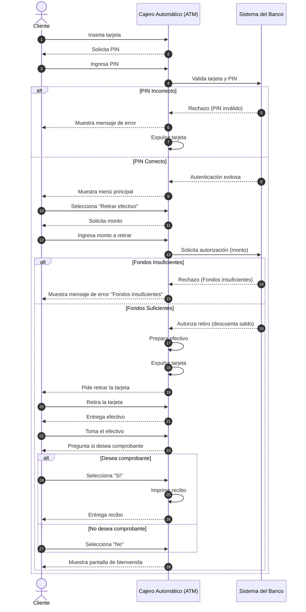

# Diagrama de Secuencia - Cajero Automático (ATM)

```mermaid
sequenceDiagram
    autonumber
    actor Cliente
    participant Cajero as Cajero Automático (ATM)
    participant Banco as Sistema del Banco

    Cliente->>Cajero: Inserta tarjeta
    Cajero-->>Cliente: Solicita PIN
    Cliente->>Cajero: Ingresa PIN
    Cajero->>Banco: Valida tarjeta y PIN

    alt PIN Incorrecto
        Banco-->>Cajero: Rechazo (PIN inválido)
        Cajero-->>Cliente: Muestra mensaje de error
        Cajero->>Cajero: Expulsa tarjeta
    else PIN Correcto
        Banco-->>Cajero: Autenticación exitosa
        Cajero-->>Cliente: Muestra menú principal
        
        Cliente->>Cajero: Selecciona "Retirar efectivo"
        Cajero-->>Cliente: Solicita monto
        Cliente->>Cajero: Ingresa monto a retirar
        Cajero->>Banco: Solicita autorización (monto)
        
        alt Fondos Insuficientes
            Banco-->>Cajero: Rechazo (Fondos insuficientes)
            Cajero-->>Cliente: Muestra mensaje de error "Fondos insuficientes"
        else Fondos Suficientes
            Banco-->>Cajero: Autoriza retiro (descuenta saldo)
            Cajero->>Cajero: Prepara efectivo
            Cajero->>Cajero: Expulsa tarjeta
            Cajero-->>Cliente: Pide retirar la tarjeta
            Cliente->>Cajero: Retira la tarjeta
            Cajero-->>Cliente: Entrega efectivo
            Cliente->>Cajero: Toma el efectivo
            Cajero-->>Cliente: Pregunta si desea comprobante
            
            alt Desea comprobante
                Cliente->>Cajero: Selecciona "Sí"
                Cajero->>Cajero: Imprime recibo
                Cajero-->>Cliente: Entrega recibo
            else No desea comprobante
                Cliente->>Cajero: Selecciona "No"
            end
            
            Cajero-->>Cliente: Muestra pantalla de bienvenida
        end
    end
```
